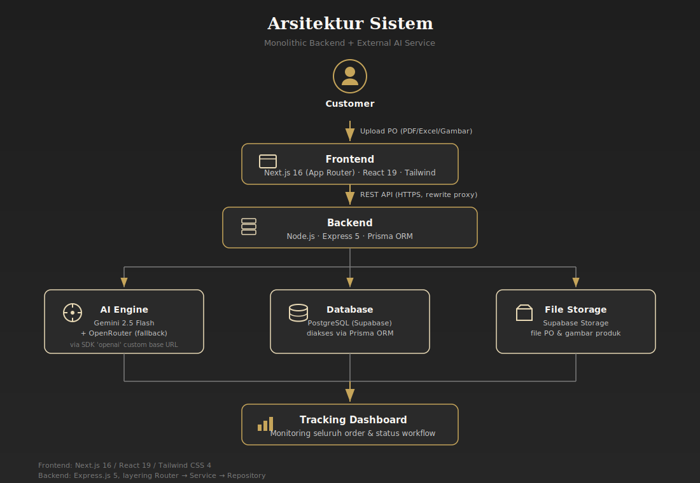
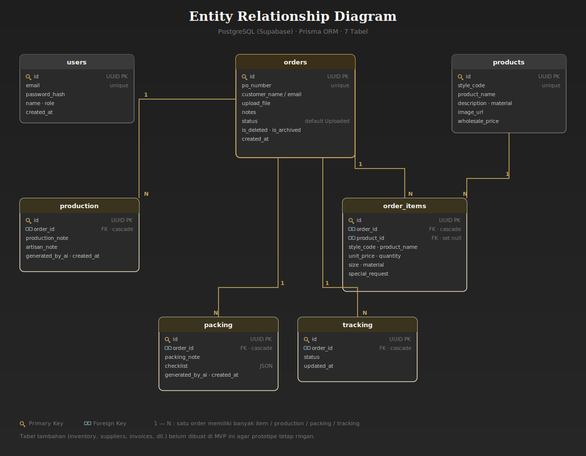
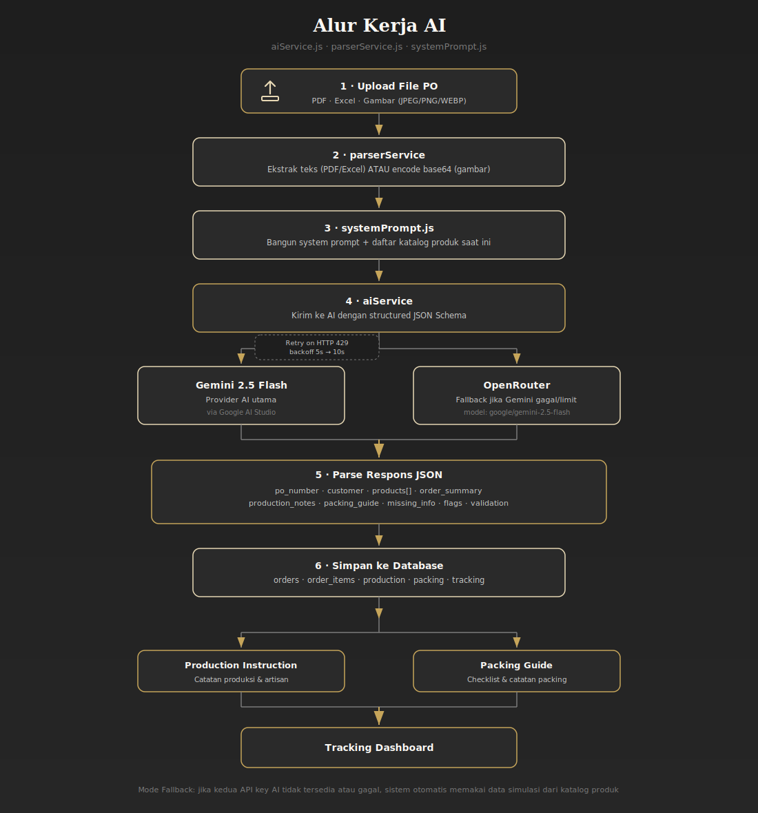

<p align="center">
  
</p>

# 💎 Heather Benjamin Jewelry — AI Order-to-Production Assistant

> Automatically transform customer Purchase Orders (PDF, Excel, or image) into production instructions, packing guides, and organized order tracking — powered by AI.

[](#)
[](#)
[](#)
[](#)
[](#-license)

---

## 📑 Table of Contents

- [About the Project](#-about-the-project)
- [Background & Business Case](#-background--business-case)
- [Key Features](#-key-features)
- [Tech Stack](#-tech-stack)
- [System Architecture](#-system-architecture)
- [Folder Structure](#-folder-structure)
- [Database Schema](#-database-schema)
- [AI Workflow](#-ai-workflow)
- [Installation & Running the Project](#-installation--running-the-project)
- [Environment Variables](#-environment-variables)
- [API Documentation](#-api-documentation)
- [Frontend Pages & Routing](#-frontend-pages--routing)
- [Order Status & Workflow](#-order-status--workflow)
- [Design System](#-design-system)
- [Security](#-security)
- [Roadmap](#-roadmap--future-enhancements)
- [Related Documents](#-related-documents)
- [Team & Roles](#-team--roles)
- [License](#-license)

---

## 📖 About the Project

**Heather Benjamin Jewelry** is a premium handmade jewelry brand that collaborates with artisans and production partners in Bali. Currently, the process of handling **Purchase Orders (POs)** from wholesale customers is done entirely manually: reading PO documents, identifying products, preparing production instructions, coordinating with artisans, creating packing guides, and updating customers.

This manual process is **slow, error-prone**, and heavily dependent on the founder's personal knowledge.

This project is an **MVP prototype built during a hackathon (48–72 hours)** — a full-stack web application that serves as an **AI Order-to-Production Assistant**, capable of:

1. Accepting PO uploads in **PDF, Excel, or image (JPEG/PNG/WEBP)** format.
2. Extracting PO data (customer, PO number, products, quantity, material, size, special notes) using **AI Vision/LLM**.
3. Validating data completeness (detecting missing products, sizes, or materials).
4. Automatically generating **production instructions** for artisans.
5. Automatically generating **packing guides** with checklists.
6. Tracking order progress from start to finish via a **tracking dashboard**.

---

## 🎯 Background & Business Case

Summarized from the business brief (see [`maua72.md`](./maua72.md)):

- POs arrive in various formats (PDF, spreadsheet, email, order form) and often contain many different products, styles, materials, and special requests.
- Critical information is scattered across multiple places (spreadsheets, documents, images, emails, chats), which risks causing:
  - Production misunderstandings
  - Wrong products or quantities
  - Packing errors
  - Delayed customer communication
  - Difficulty tracking orders
  - Over-reliance on the founder's knowledge

**Business goal:** reduce order processing and coordination time by **80%**, with the following workflow:

```
Customer Order → Production → Quality Control → Packing → Shipping → Customer Update
```

This system acts as a **single source of truth** that transforms raw POs into clear instructions — for both the production team and the fulfillment team in Bali — without requiring additional clarification from the founder.

> 📌 Full business and functional requirements are documented in [`PRD.md`](./PRD.md).

---

## ✨ Key Features

| Feature | Description |
|---|---|
| 🔐 **Admin/Manager Authentication** | JWT-based login for operational staff |
| 📤 **Purchase Order Upload** | Drag & drop support for PDF / Excel (XLS, XLSX) / Image (JPEG, PNG, WEBP) files, up to 10MB |
| 🤖 **AI Data Extraction** | AI reads PO documents/images and converts them into structured JSON (customer, items, quantity, material, size, price, etc.) |
| ✅ **Automatic Validation** | Detects missing information (unknown products, empty sizes, invalid style codes, etc.) |
| 🛠️ **Production Instructions** | Automatically generates production notes and artisan instructions |
| 📦 **Packing Guide** | Generates a per-item packing checklist with packaging notes |
| 📊 **Dashboard & Tracking** | Monitors all orders and their statuses (Uploaded → Reviewed → Production → QC → Packing → Shipping → Completed) |
| 🗃️ **Order Management** | Edit order/item details, update status, soft delete, archive, and restore |
| 📚 **Product Catalog** | Full CRUD for the product catalog (style code, name, material, image, wholesale price) to assist AI in matching items |
| 🛡️ **AI Fallback Mode** | If the AI API key is unavailable or fails, the system automatically uses simulated data so demos continue to work smoothly |

---

## 🧰 Tech Stack

### Backend
| Component | Technology |
|---|---|
| Runtime | Node.js |
| Framework | Express.js 5 |
| ORM | Prisma ORM |
| Database | PostgreSQL (Supabase) |
| File Storage | Supabase Storage |
| Authentication | JWT (`jsonwebtoken`) + `bcryptjs` |
| Upload Handler | Multer (in-memory storage) |
| Document Parsing | `pdf-parse` (PDF), `xlsx` (Excel) |
| AI Provider | Google Gemini 2.5 Flash via **Google AI Studio** (primary) & **OpenRouter** (fallback) — using the `openai` SDK with a custom base URL |
| PDF Generator | `pdfkit` (available for document exports) |

### Frontend
| Component | Technology |
|---|---|
| Framework | Next.js 16 (App Router) |
| UI Library | React 19 |
| Styling | Tailwind CSS 4 |
| Upload UI | `react-dropzone` |
| Language | TypeScript |

---

## 🏗️ System Architecture

The architecture follows a **Monolithic Backend + External AI Service** pattern, chosen for rapid development within the hackathon timeline.

<p align="center">
  
</p>

<details>
<summary><b>View the main flow as text</b></summary>

```
Customer → Upload PO → Frontend → Backend → AI Extraction
   → Validation → Save to Database
   → ┌─ Production Instruction
     └─ Packing Guide
   → Tracking Dashboard → Completed
```

</details>

### Backend (Feature-based Modular)

```
backend/src/
├── auth/        → Authentication module (repository, service, router)
├── product/     → Product catalog module
├── order/       → Order module (upload, AI extraction, status, production, packing)
├── config/      → Prisma & Supabase connection
├── middleware/  → JWT auth guard, Multer upload guard
├── services/    → aiService, parserService, storageService, systemPrompt
└── app.js       → Express entry point
```

Each module follows this layering pattern: **Router → Service (business logic + AI) → Repository (Prisma/DB)**.

### Frontend (Next.js App Router)

```
frontend/src/
├── app/
│   ├── page.tsx              → PO Upload Page (Home)
│   ├── login/                → Login Page
│   ├── dashboard/            → Dashboard & order list
│   ├── review/[id]/          → Review AI extraction results
│   ├── production/[id]/      → Production instructions
│   ├── packing/[id]/         → Packing guide & checklist
│   └── tracking/[id]/        → Order status tracking
└── components/
    ├── ClientWrapper.tsx
    └── WorkflowStepper.tsx   → Visual stepper: Production → Packing, etc.
```

> The full system architecture is also described in [`ARCHITECTURE.md`](./ARCHITECTURE.md)

---

## 📂 Folder Structure

<details>
<summary><b>Click to view the full folder structure</b></summary>

```
HeatherBenjaminJewelry/
├── README.md                 ← (this file)
├── PRD.md                    ← Product Requirements Document
├── ARCHITECTURE.md           ← System architecture document
├── DATABASE.md               ← Database design document
├── DESIGN.md                 ← Design system & UI guidelines
├── maua72.md                 ← Original business case (hackathon brief)
│
├── backend/
│   ├── backend.md            ← Backend technical documentation
│   ├── package.json
│   ├── prisma/
│   │   ├── schema.prisma     ← Database schema (Prisma)
│   │   └── migrations/       ← Database migration history
│   └── src/
│       ├── app.js
│       ├── auth/
│       ├── product/
│       ├── order/
│       ├── config/
│       ├── middleware/
│       └── services/
│
├── frontend/
│   ├── README.md             ← Default Next.js README
│   ├── AGENTS.md / CLAUDE.md ← Internal instructions for AI coding agents
│   ├── package.json
│   ├── next.config.ts        ← Proxy rewrite configuration to backend
│   └── src/
│       ├── app/
│       └── components/
│
├── data/
│   └── data.md                ← (placeholder for dataset/product catalog)
│
└── docs/
    └── docs.md                ← (placeholder for additional documentation)
```

</details>

---

## 🗄️ Database Schema

The database uses **PostgreSQL** (hosted via **Supabase**) with **Prisma ORM**. The actual schema (`backend/prisma/schema.prisma`) consists of 7 tables:

### Entity Relationship Diagram

<p align="center">
  
</p>

<details>
<summary><b>View relationships as text</b></summary>

```
users

orders 1──N order_items N──1 products
orders 1──N production
orders 1──N packing
orders 1──N tracking
```

</details>

<details>
<summary><b>📋 Column details for each table (click to expand)</b></summary>

### Table `users`
| Column | Type | Description |
|---|---|---|
| id | UUID (PK) | |
| email | VARCHAR (unique) | |
| password_hash | VARCHAR | Hashed with bcrypt |
| name | VARCHAR | |
| role | VARCHAR | Default `manager` |
| created_at | TIMESTAMP | |

### Table `orders`
| Column | Type | Description |
|---|---|---|
| id | UUID (PK) | |
| po_number | VARCHAR (unique) | |
| customer_name | VARCHAR | |
| customer_email | VARCHAR | Nullable |
| upload_file | TEXT | Supabase Storage public URL |
| notes | TEXT | |
| status | VARCHAR | Default `Uploaded` |
| is_deleted | BOOLEAN | Soft delete flag |
| is_archived | BOOLEAN | Archive flag |
| created_at | TIMESTAMP | |

### Table `order_items`
| Column | Type | Description |
|---|---|---|
| id | UUID (PK) | |
| order_id | UUID (FK → orders, cascade) | |
| product_id | UUID (FK → products, set null) | Nullable if product is unrecognized |
| style_code | VARCHAR | Nullable |
| product_name | VARCHAR | Nullable |
| unit_price | DECIMAL(12,2) | Default 0 |
| quantity | INTEGER | |
| size | VARCHAR | Nullable |
| material | VARCHAR | Nullable |
| special_request | TEXT | Nullable |

### Table `products`
| Column | Type | Description |
|---|---|---|
| id | UUID (PK) | |
| style_code | VARCHAR (unique) | |
| product_name | VARCHAR | |
| description | TEXT | Nullable |
| material | VARCHAR | Nullable |
| image_url | TEXT | Nullable |
| wholesale_price | DECIMAL(12,2) | Default 0 |

### Table `production`
| Column | Type | Description |
|---|---|---|
| id | UUID (PK) | |
| order_id | UUID (FK → orders, cascade) | |
| production_note | TEXT | AI-generated |
| artisan_note | TEXT | AI-generated |
| generated_by_ai | BOOLEAN | Default true |
| created_at | TIMESTAMP | |

### Table `packing`
| Column | Type | Description |
|---|---|---|
| id | UUID (PK) | |
| order_id | UUID (FK → orders, cascade) | |
| packing_note | TEXT | AI-generated |
| checklist | JSON | Default `[]` |
| generated_by_ai | BOOLEAN | Default true |
| created_at | TIMESTAMP | |

### Table `tracking`
| Column | Type | Description |
|---|---|---|
| id | UUID (PK) | |
| order_id | UUID (FK → orders, cascade) | |
| status | VARCHAR | One of the workflow statuses |
| updated_at | TIMESTAMP | |

</details>

> Additional tables for future development (`inventory`, `suppliers`, `invoices`, `notifications`, `audit_logs`, `ai_prompt_history`) are intentionally **excluded** from this MVP to keep the prototype lightweight.

---

## 🤖 AI Workflow

Key files: `backend/src/services/aiService.js`, `parserService.js`, `systemPrompt.js`.

<p align="center">
  
</p>

<details>
<summary><b>View the AI flow as text</b></summary>

```
Upload File (PDF/Excel/Image)
        │
        ▼
parserService → extract text (PDF/Excel) OR encode base64 (image)
        │
        ▼
systemPrompt.js → build system prompt + current product catalog list
        │
        ▼
aiService → send to AI with structured JSON Schema
        │
   ┌────┴────┐
   ▼         ▼
Gemini 2.5  OpenRouter (fallback if Gemini fails/rate-limited)
Flash       (model: google/gemini-2.5-flash)
   │
   ▼
Parse JSON response (po_number, customer, products[], order_summary,
production_notes, packing_guide, missing_info, flags, validation, etc.)
   │
   ▼
Save to database (orders, order_items, production, packing, tracking)
```

</details>

**Structured AI output includes:**
- PO data: `po_number`, `order_date`, `ship_date`, `payment_terms`, `customer` info
- `products` list (style code, name, material, finish, size, unit price, quantity, subtotal, special notes)
- `order_summary` (total SKUs, total units, total order value, currency, shipping method)
- `production_notes` (urgent items, gift items, fragile items, custom requests)
- `packing_guide` (item checklist, carton labels, shipping method, whether tracking is required)
- `missing_info` & `flags` → basis for automatic validation
- `validation` → subtotal/total/style code matching checks

**Retry mechanism:** if a rate limit (HTTP 429) is encountered, the system automatically retries with backoff (5s, then 10s) before switching to the next AI provider.

### 🛟 Fallback Mode (without AI)
If **no** AI API key is configured, **or** all AI attempts fail, the system **will not crash**. The backend automatically generates mock data based on the product catalog in the database, including a `"⚠️ This is FALLBACK data..."` warning in `validation_warnings` — ensuring demos can still run smoothly.

---

## 🚀 Installation & Running the Project

### Prerequisites
- Node.js (latest LTS version recommended)
- A [Supabase](https://supabase.com) account and project (PostgreSQL + Storage)
- AI API Key: [Google AI Studio (Gemini)](https://aistudio.google.com) and/or [OpenRouter](https://openrouter.ai)

### 1. Clone the Repository
```bash
git clone <repo-url>
cd HeatherBenjaminJewelry
```

### 2. Set Up the Backend
```bash
cd backend
npm install
```

Create a `.env` file in the `backend/` folder (see [Environment Variables](#-environment-variables)).

Generate the Prisma client and push the schema to your Supabase database:
```bash
npx prisma generate
npx prisma db push
```

Start the server (dev mode with hot-reload):
```bash
npm run dev
```
The backend will run at `http://localhost:5000`.

> 💡 Make sure you have created a **Storage bucket** named `purchase-orders` in Supabase Storage so PO file uploads are saved successfully.

### 3. Set Up the Frontend
```bash
cd frontend
npm install
```

Create a `.env.local` file (optional, only if the backend is not running at `localhost:5000`):
```env
BACKEND_API_URL=http://127.0.0.1:5000
```

Start the dev server:
```bash
npm run dev
```
The frontend will run at `http://localhost:3000`. All `/api/*` and `/data/images/*` requests are automatically proxied to the backend via `next.config.ts`.

### 4. Create the First Admin/Manager User
Since there is no registration UI yet, use the API endpoint directly (see [API Documentation](#-api-documentation)):
```bash
curl -X POST http://localhost:5000/api/auth/register \
  -H "Content-Type: application/json" \
  -d '{"email":"manager@heatherbenjamin.com","password":"securepassword123","name":"Operations Manager","role":"manager"}'
```
Then log in via the `/login` page on the frontend.

---

## 🔑 Environment Variables

### Backend (`backend/.env`)
| Variable | Required | Description |
|---|---|---|
| `PORT` | Optional | Default `5000` |
| `DATABASE_URL` | ✅ | Supabase Postgres connection string (pooler, for Prisma Client runtime) |
| `DIRECT_URL` | ✅ | Direct Supabase Postgres connection string (for Prisma migrations) |
| `SUPABASE_URL` | ✅ | Supabase project URL |
| `SUPABASE_KEY` | ✅ | Supabase service role key or anon key |
| `JWT_SECRET` | ✅ | Secret for signing JWTs (login) |
| `GEMINI_API_KEY` | Optional* | Google AI Studio (Gemini) API key — primary AI provider |
| `OPENROUTER_API_KEY` | Optional* | OpenRouter API key — fallback AI provider |
| `FRONTEND_URL` | Optional | For additional CORS origin configuration beyond `localhost:3000` |

\* If **both** AI keys are not set, the system automatically runs in [fallback mode](#-fallback-mode-without-ai).

### Frontend (`frontend/.env.local`)
| Variable | Required | Description |
|---|---|---|
| `BACKEND_API_URL` | Optional | Default `http://127.0.0.1:5000`, used by the Next.js rewrite proxy |

---

## 📡 API Documentation

Backend base URL: `http://localhost:5000/api` (or accessed via the frontend proxy at `/api`).

### Health Check
| Method | Route | Description |
|---|---|---|
| `GET` | `/api` | API status |
| `GET` | `/api/db-check` | Check database connection via Prisma |

### 🔐 Authentication (`/api/auth`)

| Method | Route | Description |
|---|---|---|
| `POST` | `/api/auth/register` | Register a new admin/manager user |
| `POST` | `/api/auth/login` | Log in and receive a JWT token |

<details>
<summary><b>Example request &amp; response</b></summary>

**Register**
```http
POST /api/auth/register
Content-Type: application/json

{
  "email": "manager@heatherbenjamin.com",
  "password": "securepassword123",
  "name": "Operations Manager",
  "role": "manager"
}
```

**Login**
```http
POST /api/auth/login
Content-Type: application/json

{
  "email": "manager@heatherbenjamin.com",
  "password": "securepassword123"
}
```
Response:
```json
{
  "message": "Login successful.",
  "token": "JWT_TOKEN_HERE",
  "user": {
    "id": "uuid-here",
    "email": "manager@heatherbenjamin.com",
    "name": "Operations Manager",
    "role": "manager"
  }
}
```

</details>

> All endpoints below **require** the `Authorization: Bearer <JWT_TOKEN>` header.

### 📚 Product Catalog (`/api/products`)

| Method | Route | Description |
|---|---|---|
| `GET` | `/api/products` | Retrieve all products |
| `POST` | `/api/products` | Add a new product |

<details>
<summary><b>Example request body</b></summary>

Body for `POST /api/products`:
```json
{
  "style_code": "HB102",
  "product_name": "Balinese Gold Band Ring",
  "description": "Handmade gold band ring with filigree patterns.",
  "material": "Gold",
  "image_url": "https://example.com/hb102.jpg",
  "wholesale_price": 120.00
}
```

</details>

### 📦 Purchase Order / Order (`/api/orders`)

| Method | Route | Description |
|---|---|---|
| `POST` | `/api/orders/upload` | Upload a PO file → processed by AI → saved |
| `GET` | `/api/orders` | Retrieve all orders (supports query filters) |
| `GET` | `/api/orders/:id` | Full order details (items, production, packing, tracking) |
| `PUT` | `/api/orders/:id` | Update order & item details |
| `PUT` | `/api/orders/:id/status` | Update order status |
| `PUT` | `/api/orders/:id/production` | Update production notes & artisan notes |
| `PUT` | `/api/orders/:id/packing` | Update packing notes & checklist |
| `PUT` | `/api/orders/:id/archive` | Archive an order |
| `PUT` | `/api/orders/:id/restore` | Restore an archived order |
| `DELETE` | `/api/orders/:id` | Soft delete an order |

<details>
<summary><b>Example request &amp; response</b></summary>

**Upload PO**
```http
POST /api/orders/upload
Content-Type: multipart/form-data

file: <PDF | XLS | XLSX | JPEG | PNG | WEBP, max 10MB>
```
Response:
```json
{
  "message": "Purchase Order uploaded, processed by AI, and saved successfully.",
  "order": {
    "id": "uuid-order-id",
    "po_number": "PO-99128",
    "customer_name": "Global Boutique Ltd",
    "customer_email": "purchasing@globalboutique.com",
    "upload_file": "https://supabase-url.co/storage/v1/object/public/purchase-orders/po/...pdf",
    "notes": "Express production requested.",
    "status": "Uploaded",
    "created_at": "2026-06-26T09:30:00Z",
    "validation_warnings": []
  }
}
```

**Query filters for `GET /api/orders`:**
`search`, `status`, `date`, `customer`, `sortBy`, `isArchived`, `isDeleted`

**Update Status**
```http
PUT /api/orders/:id/status
Content-Type: application/json

{ "status": "Production" }
```
Valid values: `Uploaded`, `Reviewed`, `Production`, `QC`, `Packing`, `Shipping`, `Completed`.

</details>

> 📌 Full backend technical documentation (setup, endpoints, example responses): [`backend/backend.md`](./backend/backend.md)

---

## 🖥️ Frontend Pages & Routing

| Route | Page | Description |
|---|---|---|
| `/` | Upload PO | Home page with drag & drop PO file upload |
| `/login` | Login | Admin/manager login |
| `/dashboard` | Dashboard | List and monitor all orders |
| `/review/[id]` | Review Order | Review & correct AI extraction results before final save |
| `/production/[id]` | Production Instructions | View/edit production notes & artisan instructions per order |
| `/packing/[id]` | Packing Guide | View/edit packing notes & item checklist |
| `/tracking/[id]` | Tracking | Monitor order status & progress history |

The `WorkflowStepper` component displays a visual progress indicator across stages (Production → Packing, etc.) on each relevant page.

---

## 🔄 Order Status & Workflow

```
Uploaded → Reviewed → Production → QC → Packing → Shipping → Completed
```

| Status | Meaning |
|---|---|
| `Uploaded` | PO file has just been uploaded & extracted by AI |
| `Reviewed` | Data has been checked/validated by operational staff |
| `Production` | Being worked on by artisans/production team |
| `QC` | Quality Control |
| `Packing` | Packing in progress |
| `Shipping` | In transit |
| `Completed` | Order fulfilled |

In addition to the statuses above, orders also carry two extra flags: **`is_archived`** (archived) and **`is_deleted`** (soft delete — the record is not actually removed from the database).

---

## 🎨 Design System

Brand positioning: **"a luxury jewelry boutique with timeless elegance"** — not a marketplace or a generic admin template.

| Token | Value |
|---|---|
| Primary — Luxury Gold | `#C6A55A` |
| Secondary — Ivory White | `#FAF8F4` |
| Accent — Champagne | `#E8D9B5` |
| Dark — Charcoal Black | `#1E1E1E` |
| Neutral — Warm Gray | `#7A7A7A` |
| Heading Font | Playfair Display (fallback: Georgia) |
| Body Font | Inter (fallback: sans-serif) |
| Border Radius | Button 12px · Card 18px · Modal 24px |

Supports **Light Mode** & **Dark Mode** with separate color tokens, smooth transitions (`transition-colors duration-300`), and a Sun/Moon icon toggle in the navbar.

> 📌 Full details (typography scale, layout, animations, component rules, accessibility): [`DESIGN.md`](./DESIGN.md)

---

## 🔒 Security

- Passwords are hashed using **bcryptjs** before being stored.
- **JWT**-based authentication, validated via middleware (`middleware/auth.js`) on every private endpoint.
- File uploads are restricted by type (`PDF`, `XLS/XLSX`, `JPEG/PNG/WEBP`) and a maximum size of **10MB** (Multer file filter).
- **CORS** is restricted to registered origins only (`localhost:3000` & `FRONTEND_URL`).
- API keys (Supabase, AI provider, JWT secret) are stored in **environment variables** and never hardcoded.
- Sensitive customer information is minimized in accordance with the principles outlined in [`PRD.md`](./PRD.md) & [`ARCHITECTURE.md`](./ARCHITECTURE.md).
- Orders are never permanently deleted — **soft delete** (`is_deleted`) is used to maintain an audit trail.

> ⚠️ For a real production environment, it is strongly recommended to add: rate limiting, stricter input validation/sanitization, secret rotation, enforced HTTPS, and audit logging.

---

## 🗺️ Roadmap / Future Enhancements

Beyond the current MVP scope, planned for future development:

- **Shopify** integration
- **QuickBooks** integration
- **Inventory Management**
- **WhatsApp** & **Email** notifications
- **Analytics Dashboard**
- More granular **Role-Based Access Control (RBAC)**
- **Supplier Management**
- Additional tables: `inventory`, `suppliers`, `invoices`, `notifications`, `audit_logs`, `ai_prompt_history`

---

## 📄 Related Documents

| Document | Contents |
|---|---|
| [`PRD.md`](./PRD.md) | Product Requirements Document — business & functional requirements |
| [`ARCHITECTURE.md`](./ARCHITECTURE.md) | Comprehensive system architecture |
| [`DATABASE.md`](./DATABASE.md) | Database design |
| [`DESIGN.md`](./DESIGN.md) | Design system & UI/UX guidelines |
| [`maua72.md`](./maua72.md) | Original business case from the hackathon organizers |
| [`backend/backend.md`](./backend/backend.md) | Backend technical documentation (setup, API, fallback mode) |
| [`frontend/README.md`](./frontend/README.md) | Default Next.js README (create-next-app) |

---

## 👥 Team & Roles

As defined in the team structure in [`PRD.md`](./PRD.md):

| Role | Responsibilities |
|---|---|
| **Backend** | Database, REST API, AI integration, deployment |
| **Frontend + UI/UX** | Dashboard, upload page, tracking, production, packing |
| **Data Engineer** | Product catalog, style codes, images, material mapping, sample POs |
| **AI Engineer** | Prompt engineering, document extraction, validation, production & packing generators |
| **QA & Support** | API testing, integration testing, bug reporting |
| **PM + Documentation** | Requirement gathering, sprint planning, documentation, presentations, demo video |

---

## 📜 License

© 2026 **Heather Benjamin Jewelry**. All Rights Reserved.

This project is a **proprietary** prototype developed for internal use by Heather Benjamin Jewelry (as a hackathon/competition entry). The source code, documentation, and assets contained herein may not be copied, modified, or redistributed by any third party without the written permission of the project owner.

---

<p align="center">Built with 💛 for <strong>Heather Benjamin Jewelry</strong> — transforming the way Purchase Orders are processed, from manual to automated with AI.</p>
